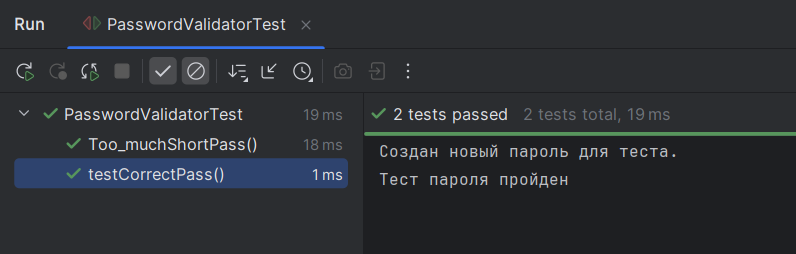
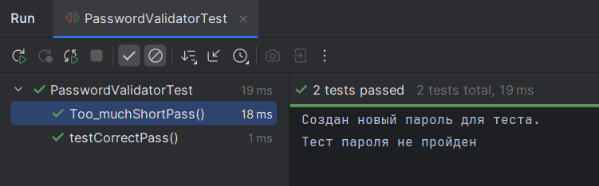
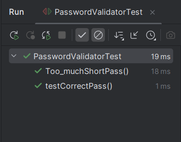

Лабораторная работа №2_1: Тестовое окружение в JUnit

## 👨‍🎓 Студент
- **ФИО:** Салахов Ислам Ринатович
- **Группа:** ИС-245
- **Вариант:** 24 (Валидатор пароля)

---

## ✅ Выполненные задания

### Задание 1 (Простое)
**Тест:**  создания валидатора с minLength=8 и requireDigit=true

### Задание 2 (Среднее)
**Тесты:** Проверьте валидацию паролей
- Корректный пароль "pass1234" (длина 8, есть цифра) — возвращает true.
- Слишком короткий пароль "pass" (длина 4) — возвращает false.

---

## 📊 Результаты

---

## 📎 Ссылки
- [Код тестов](PasswordValidatorTest.java)
- [Основной класс](PasswordValidator.java)

*Дата: 19.05.2026*
